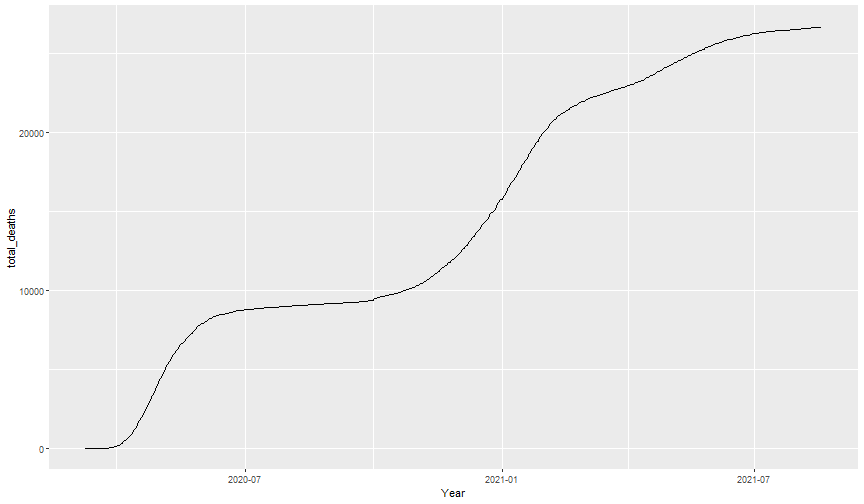

## Summary
The app has been done as a final assignment of the course.
The data ised in the app can be obtained from the open source:
https://covid.ourworldindata.org/data/owid-covid-data.csv

The data for the project has been slighly modified for simplicity, it will be overview in slide 3.
The app shows the side panel with the options to input and 4 tabs with the outputs.

---

## Tabs of the apps
* Tab 1: the visual representation of the changes in Covid-19 numbers related to death or number of cases.
<br>
* Tab2: includes the tabular format of the same information.
<br>
* Tab3: the prediction Tab includes plot of linear regression of new daily cases and 
potential number of new daily cases in 6-month time in the selected country.
<br>
* Tab 4: the documentation, overview of the app related information.

---

## Overview of the Data manipulation

```r
#download file and subset the data
temp <- tempfile()
download.file(
   "https://covid.ourworldindata.org/data/owid-covid-data.csv", temp)
mydata<-read.csv(temp)
unlink(temp)
mywdata<-mydata[,c(2,3,4,5,8,9)]
mywdata<-mywdata[complete.cases(mywdata$total_deaths),]
mywdata<-subset(mywdata, mywdata$continent!="")
head(mywdata,2)
```

```
##    continent    location       date total_cases total_deaths new_deaths
## 28      Asia Afghanistan 2020-03-22          34            1          1
## 29      Asia Afghanistan 2020-03-23          41            1          0
```

---

## Plot Example for Canada


---

## Prediction Example for Canada

```r
library(lubridate)
mdata<-subset(mywdata, mywdata$location=="Canada")
model<-lm(new_deaths~as.Date(date), data=mdata)
d <- ymd(Sys.Date()) %m+% months(6)
pr<-round(predict(model, newdata = data.frame('date'=as.character(d))),0)
paste("The predicted number of new deaths in 6 months time for Canada") 
```

```
## [1] "The predicted number of new deaths in 6 months time for Canada"
```

```r
paste("based on the previous data is", pr )
```

```
## [1] "based on the previous data is 23"
```
